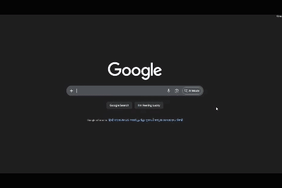

# Vozy: Installation & handoff guide

This document is written for **whoever installs or ships this extension** (another developer, QA, or a power user). It assumes you have the project folder on disk (for example after cloning a repo or unzipping a release) and need to load it into Chromium-based browsers on a PC or Mac.

---

## What this extension does

**Vozy** adds voice-to-text to normal web pages: chat UIs (ChatGPT-style editors), `<textarea>`, text/search `<input>` fields, and many `contenteditable` surfaces. Speech is sent to **AssemblyAI** over the network (not a self-hosted model). A small panel appears on the page; you control dictation from there and from keyboard shortcuts.

---

## Prerequisites

| Requirement | Notes |
|-------------|--------|
| **Browser** | Google Chrome or another **Chromium** browser that supports Manifest V3 extensions (e.g. Microsoft Edge, Brave). |
| **OS** | Windows, macOS, or Linux, anywhere that browser runs. |
| **Microphone** | Physical or built-in mic; browser will prompt for permission. |
| **Internet** | Required for AssemblyAI streaming API. |
| **AssemblyAI account** | Create an account at [AssemblyAI](https://www.assemblyai.com/), generate an **API key** from the dashboard. |

---

## Step 1: Get the files on the machine

1. Copy the entire extension directory to the target machine (USB, shared drive, `git clone`, or zip extract).
2. Keep the folder structure intact. At minimum you should see:

   - `manifest.json`
   - `background/` (service worker)
   - `content_script.js`, `ui.css`
   - `options.html`, `options.js`
   - `logo.png` (extension icon)

Do **not** nest the extension inside another random folder in a way that breaks paths; Chrome loads the folder you select as the extension root.

---

## Step 2: Load the extension (unpacked)

These steps are for **Google Chrome**; Edge is similar (`edge://extensions`).

1. Open Chrome and go to **`chrome://extensions`**.
2. Turn **Developer mode** ON (top-right toggle).
3. Click **Load unpacked**.
4. Choose the **folder that contains `manifest.json`** (the extension root, e.g. `voicetoprompt` on your disk).
5. Confirm **Vozy** appears in the list.
6. Ignore the "The ScriptProcessorNode is deprecated. Use AudioWorkletNode instead" Error.
7. Raise a PR for any other erros.

**Updates after code changes:** On `chrome://extensions`, click **Reload** on the extension card.

---

## Step 3: Pin the icon (optional but recommended)

1. Click the **puzzle piece** (Extensions) in the Chrome toolbar.
2. Find **Vozy** and click the **pin** icon so it stays visible.

The toolbar icon uses `logo.png` from the manifest.

---

## Step 4: Configure AssemblyAI (required)

Without a valid API key, transcription will fail.

### Option A: Extension options page

1. On `chrome://extensions`, under **Vozy**, click **Details**.
2. Open **Extension options** (or right-click the toolbar icon → **Options** if wired).
3. Set:
   - **AssemblyAI API key:** paste the key from the AssemblyAI dashboard.
   - **Speech language:** choose the language code that matches your AssemblyAI usage.
4. Changes save when you leave the field / save flow as implemented in `options.js`.

### Option B: Defaults in code (if you ship a private build)

Some builds may seed a default key in code for internal testing. **Do not ship production builds with embedded secrets.** Rotate keys if they were ever committed or shared.

---

## Step 5: Browser permissions you will see

| Permission / prompt | Why |
|---------------------|-----|
| **Microphone** | First time you start dictation, Chrome asks to allow the site/extension context to capture audio. Choose **Allow**. |
| **Extension host access** | The manifest uses broad patterns so the content script can run on normal websites. Restricted Chrome URLs (`chrome://`, Web Store, etc.) cannot run arbitrary extension scripts. |

---

## Step 6: Chrome command shortcut (global)

The manifest registers a command **`toggle-dictation`** with a suggested binding of **`Ctrl+Shift+V`** (macOS: **`Command+Shift+V`**).

That shortcut is handled by the **background service worker** and is used to **open/close the panel and toggle dictation** according to the current implementation in `content_script.js`.

### If the shortcut does nothing or conflicts

1. Open **`chrome://extensions/shortcuts`**.
2. Find **Vozy**.
3. Set **Toggle voice dictation** to a free combination and ensure it applies **In Chrome** (not only in a specific app profile if your browser offers that).

---

## Step 7: In-page panel shortcut (per user)

Inside the on-page panel there is a **read-only shortcut field**. Focus it and press the desired key combination; it is stored in **`chrome.storage.sync`** as `panelShortcut` (see `content_script.js`). That is separate from the Chrome **commands** shortcut above; both may exist, so document for your users which one you want them to rely on.

---

## Step 8: Day-to-day usage (typical flow)

1. Open a normal website (not `chrome://settings`, etc.).
2. Click into the field where you want text (input, textarea, or editor).
3. Press the **Chrome command** shortcut (or follow your panel shortcut workflow) so the **Vozy** panel appears.
4. Click **Start** to begin listening (or use the shortcut behavior implemented for “panel already open”).
5. Speak; live text is reflected in the field when streaming updates arrive.
6. **Stop** dictation with **Stop**, shortcut, **silence auto-stop** (timeout), or by **clicking outside the panel** (implementation detail in `content_script.js`).
7. Close the panel with the **×** control when finished.

### Erase codeword

Users can set an **erase key** (spoken word) in the panel or options to remove characters when recognized in the transcript stream. See `eraseCodeword` handling in `content_script.js`.

---

## Step 9: Troubleshooting (for support / developers)

| Symptom | Things to check |
|---------|-------------------|
| Panel never appears | Page must allow scripts; try a normal HTTPS site. Reload extension. Check DevTools console on the page for errors. |
| “API key missing” or AssemblyAI errors | Open options; confirm key. Check AssemblyAI dashboard for quota/billing. |
| No microphone | OS privacy settings (Windows/macOS), Chrome site permissions, correct input device. |
| Shortcut conflicts | Another extension or OS hotkey may steal the combo. Change it at `chrome://extensions/shortcuts`. |
| Text does not update in a specific app | Some shadow-DOM or heavily sandboxed editors are hard. Insertion uses standard DOM and `input`/`change` events and may need app-specific follow-up. It might not work on sites with their own built-in voice-to-text. |

**Developer inspection:**

- **Service worker:** `chrome://extensions` → Vozy → **Service worker** (Inspect views) → Console.
- **Page context:** DevTools on the tab → Console / Network (note: extension background fetch may not appear in the page’s network panel).

---

## Technical overview (for maintainers)

| Piece | Role |
|-------|------|
| `manifest.json` | MV3 manifest: permissions, `content_scripts`, `commands`, `icons`, `action`, `options_page`, AssemblyAI host permission. |
| `background/service_worker.js` | Command listener; streaming token / transcript API calls to AssemblyAI (avoid CORS issues from the page). |
| `content_script.js` | Panel UI, WebSocket streaming, mic capture, text insertion, erase codeword parsing, shortcuts. |
| `ui.css` | Panel layout and theme. |
| `options.html` / `options.js` | Synced settings (`chrome.storage.sync`). |

---

## Known limitations (set expectations for users)

- **Network dependency:** Audio is processed by AssemblyAI; offline use is not supported.
- **Restricted pages:** `chrome://`, the Chrome Web Store, PDF viewer, and some enterprise pages may block or limit extension scripts.
- **Latency:** Depends on network, model (`speech_model` in code), and browser; real-time feel varies.
- **Privacy:** Audio leaves the device to AssemblyAI under their terms; do not market as “fully local STT.”
- **API costs:** Usage is billed / limited per AssemblyAI account.

---

## Uninstall / remove from a PC

1. `chrome://extensions` → find **Vozy** → **Remove**.
2. Optionally delete the unpacked folder from disk.

---

## Support the developer

If **Vozy** saved you time or you want to encourage updates and maintenance, you can leave a small tip on [**Buy Me a Coffee**](https://buymeacoffee.com/abduwu).

---

